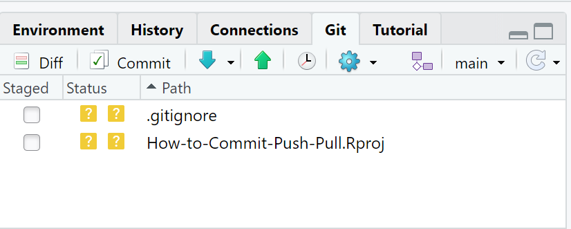
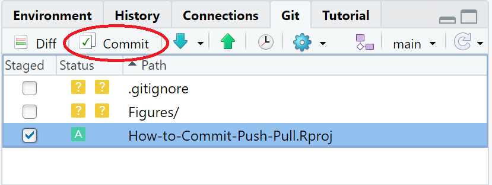
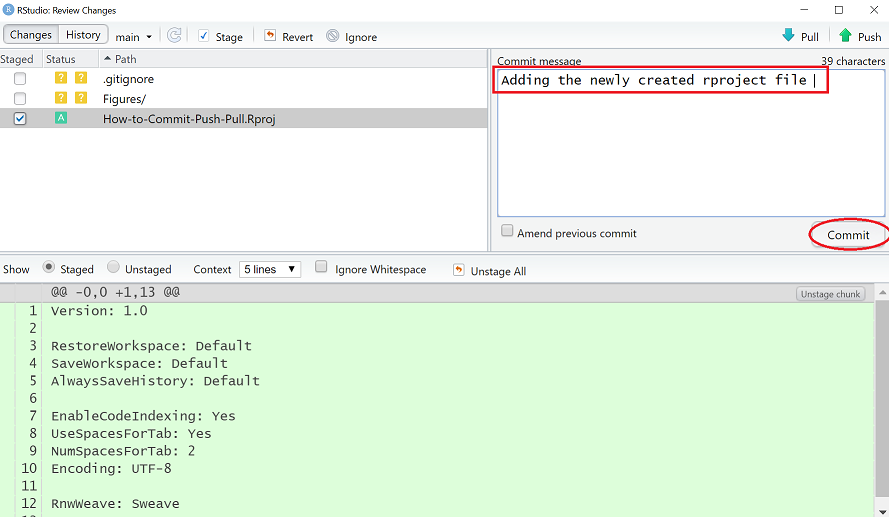
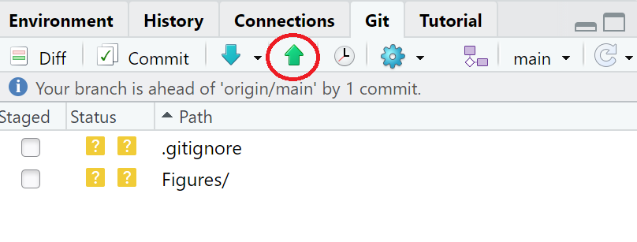
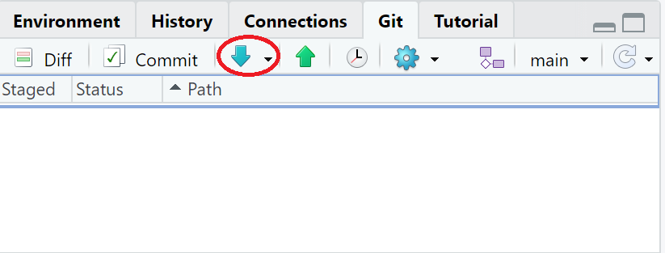
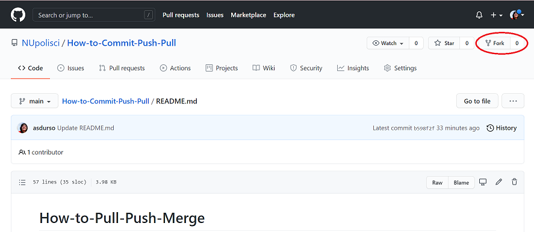
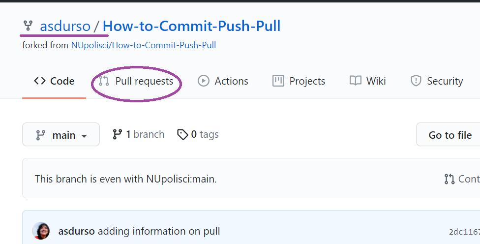
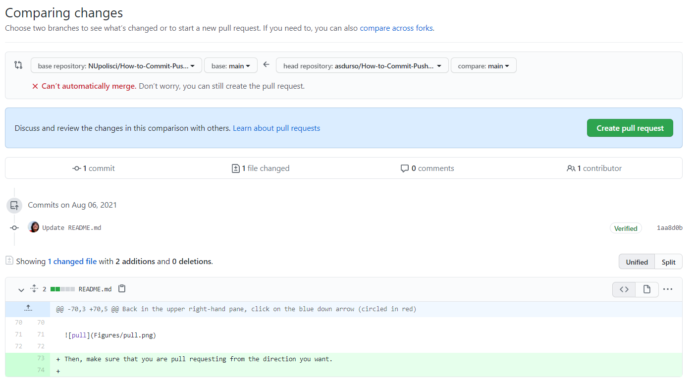

# How-to-Push-Pull-Merge
This repository is a simple guide for how to pull, push, and merge Github repositories when you are running a workshop with other people. If you are unfamiliar with Github, you should first check out this repository on [how to use Github repositories for workshops](https://github.com/NUpolisci/How-to-use-Github-repositories-for-workshops).

# Git Basics 
The best guide to use when working with Github and RStudio is [here](https://happygitwithr.com/new-github-first.html). This is just a supplementary guide to quickly compile some of the basic skills you may wish to use. 

# Committing 
Committing a code is basically bookmarking a change you have made. It does not yet add it to your repository (i.e. version control). You can commit a number of things at once, and you can commit numerous times before adding it to your repository.

There are two ways to commit: 

## 1) Commit via Terminal 
If you wish to commit via the terminal, you must first go to your terminal and write: 
`git add "your_file_name.filetype"`
`git commit "meaningful message"` 

When you are committing, the key is to write meaningful messages to your future self and your collaborators. This is basically logging what the major changes you made were. If you want to go back to a previous version to look at your code, these commit messages will be HUGE in helping you figure out what changes you made. Messages like "UGH JUST WORK", "OMG YAY", "UGH NOT AGAIN", etc... are not useful messages. You must include a message when you commit. 

## 2) Commit via RStudio 

On R studio, once you have connected your project to a github repository, you can commit via the RStudio platform. In the upper right-hand pane, you should see a tab that says 'Git'. When you click on it, you should see something like this: 

The icons in yellow with question marks mean that your local files have not yet been linked to the Github repository. Here, I have created an Rstudio project on my local computer that has not been linked to the Github repository. 

To commit, I would click on the button and then click on the Commit button (circled in red). Like this: 

Once you press commit, a pop-up will show up. Here you can add your commit message and see what the changes are  between your versions. Since this document is new, it's all newly added changes (in green). 

Once you write your message (in rectangular box), you press commit (in red box). Like this: 

**NOTE: This does not mean what you have commit will end up on your Github Repository**. You can still commit other things on top of each other, but none of it will be on Github until you `push`. 

# Pushing 
Pushing your code is taking your committed changes and sending them to your Github repository. It actually changes the files you have in Github, whereas commits do not. But you must commit before pushing. 

There are two ways to push: 

## 1) Push via Terminal 
Once in the terminal,  you type:
`git push` 

You must say this in your head in the same cadence as the song [kick push](https://www.youtube.com/watch?v=Gl83mI69nX4) (JK you are probably too young to know that song). 
And you're done! 

## 2) Push via RStudio 

To push, you press the green up arrow (circled in red). Note, RStudio will tell you how many commits ahead of your Github repository you are. That is, how many bookmarked changes (commits) have you made that are different from the version on Github. Once you push, those differences go away.  

# Pulling 
Pulling is especially important when you are working with a collaborator on a shared repository, or if you make changes on Github's website, but then continue to work on a platform like RStudio. Whereas pushing ensures the materials you have on your Github repository are up to date with the version of materials on your machine, pushing ensures the version of materials you have on your machine are up to date with with the materials you have on your Github. 

If you are working on a project with collaborators in a shared repository, it is always a good idea to pull before making any changes or committing any changes. 

There are two ways to pull: 

## 1) Pull via Terminal 
Go to your terminal and type: 
`git pull` 

## 2) Pull via RStudio

Back in the upper right-hand pane, click on the blue down arrow (circled in red) to pull. 

# Pull Requests

Pull requests are used when you have a Main repository that you want to add changes to. Why might this happen? This could happen because you are working with a repository that already exists in the NUPoliSci Github account and you want that Main repository to reflect your changes. This is different than having your own repository that NUPoliSci forks over and features on their account (because in that case, your repository would be the Main). 

## Forking 

Forking is basically creating a copy of a repository for your own account. You can make any changes that you want to the repository, but it will not make any changes to the Main repository from which you forked. 

In order to make changes to the Main, you will need to both fork the repository and initiate a pull request

There are two ways to do a pull request 

## 1) Pull Request via Terminal 

Some terminology first [from here](https://stackoverflow.com/questions/9529497/what-is-origin-in-git)

**Remote:** "Git has the concept of "remotes", which are simply URLs to other copies of your repository. When you clone another repository, Git automatically creates a remote named "origin" and points to it.""
**Origin:** "`origin` is not the remote repository name. It is rather a local ***alias*** set as a key in place of the remote repository URL.

It avoids the user having to type the whole remote URL when prompting a push.

This name is set by default and for convention by Git when cloning from a remote for the first time."

In order to get a working copy of the repository--one that can request changes to the Main repository--you must add a remote.

`git remote add nameyouwant "https://main_repository_url..."`

So you want to name your origin and you must link it to the Main repository's URL

Then, you make sure you have an updated version of the repository in your remote: 
`git pull nameyouwant main`

In order to send over a push request, you basically commit and push as you normally would: 

`git add "filename.filetype"`
`git commit "message"`
`git push`

Then, the administrator of the NUPoliSci Github will review the request and choose to accept it or not. 

## Pull Request via Interfaces

First, go to the Github repository you are interested and working with and fork it over (circled in red).

Then, go to your forked repository. You should notice that the repository has the same name as the original, but now it's housed under your Github username instead of NUPoliSci (see purple underline). Then, click on 'pull request' (circled in red).

Then, click on the green button 'New pull request'.

From there, make sure the pull request is going in the right direction, from your forked repo to the Main. 

